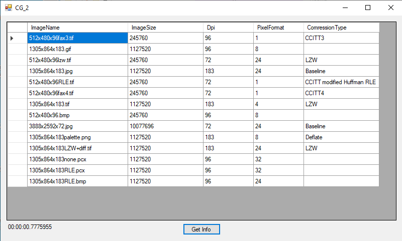

# Лабораторная работа 2

Для реализации был использован язые `C#` с использованием Windows Forms.
Так же была использована сторонняя библиотека для чтения .pcx формата.

## Руководство

В интерфейсе для пользователя представлена возможность узнать дополнительну информацию об изображении. 
Пользователь может узнать:
<li> имя файла
<li> размер изображения (в пикселях)
<li> разрешение (dot/inch)
<li> глубина цвета
<li> сжатие (для тех типов файлов, в которых оно может быть задано)

Так же пользоваетль может узнать время затраченное на считывание информации.

Был улучшена производительность. Линейная программа обробатала 2.4 гб изображений за 40.312 сек., в то время как параллельная версия справилась за 7.039 сек. 
