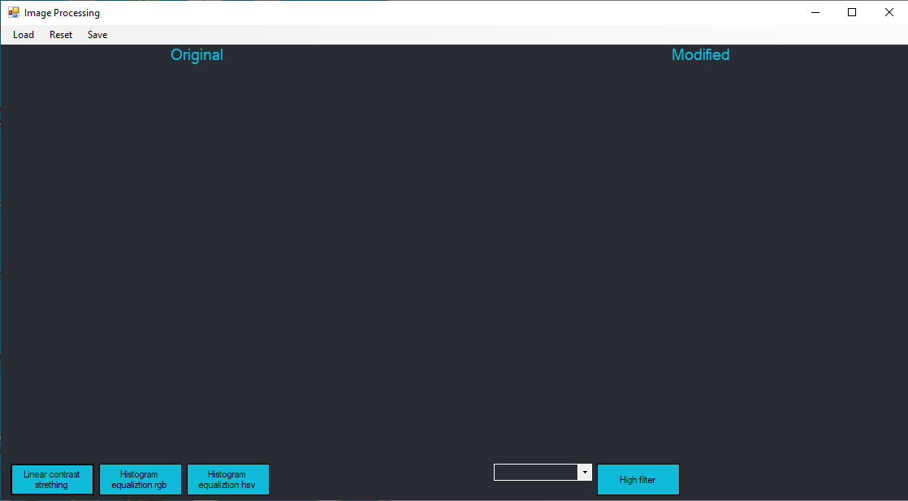
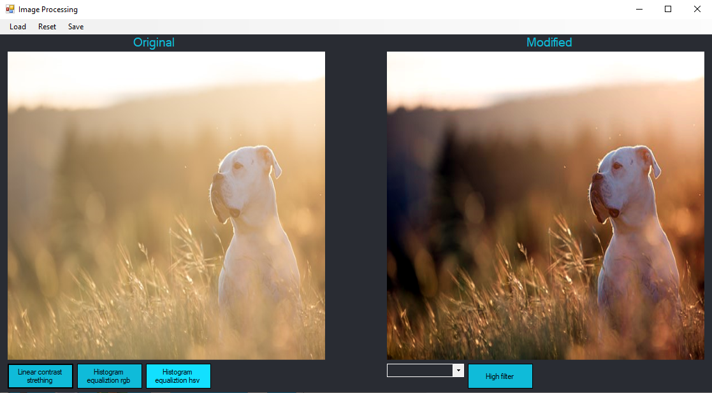
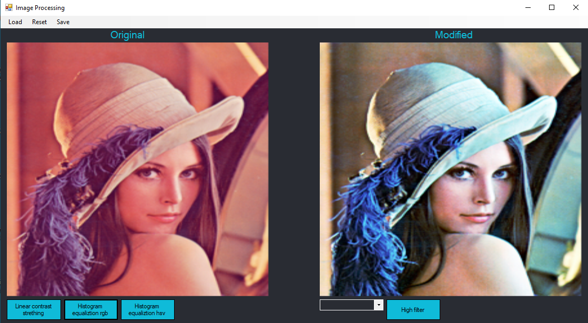
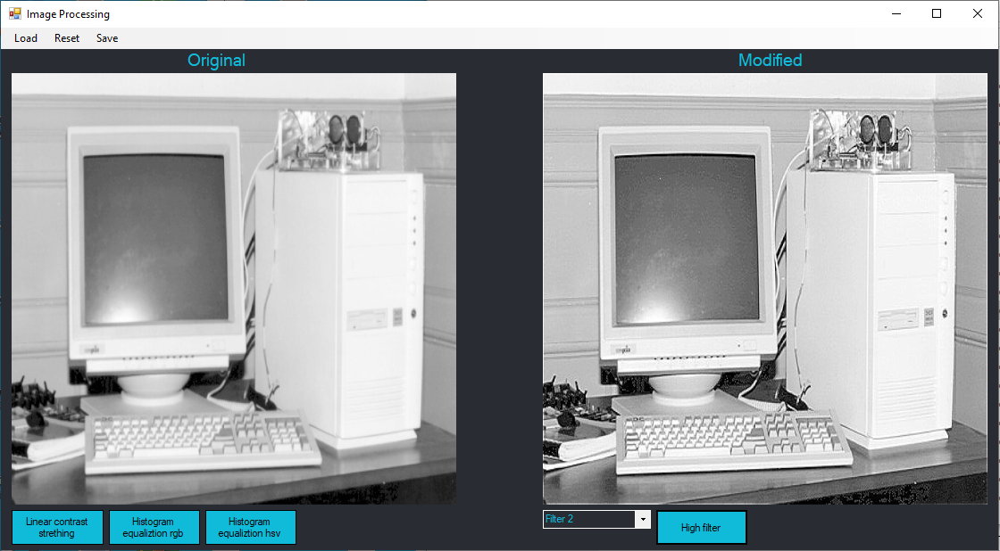
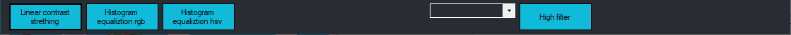

# Лабараторная работа 3

Для реализации был использован язые `C#` с использованием Windows Forms.

## Руководство

На верхней панеле доступны 3 кнопка: Load, Reset, Save. Нажав на Load, вы можете открыть требуемое вами изображение. Нажав на Reset, вы можете использовать исходное изображение. Нажав на Save, вы можете сохранить файл.
Было реализованно несколько алгоритмов:
<li> Linear contrast stretching
<li> Histogram equalization
<li> High-pass filters

#### Linear contrast stretching

Линейная растяжка сводится к присваиванию новых значений интенсивности каждому пикселю изображения. Если интенсивности исходного изображения изменялись в диапазоне, тогда необходимо линейно "растянуть" указанный диапазон так, чтобы значения изменялись от 0 до 255.

#### Histogram equalization

Цель выравнивания состоит в том, чтобы все уровни яркости имели бы одинаковую частоту, а гистограмма соответствовала равномерному закону распределения. Для RGB мы делаем выравнивание для каждого канала, а для HSV, только для компоненты яркости.

#### High-pass filters

Позволяет повысить резкость изображения. Мы применяем операцию свертки с конкретным ядром к исходному образу.

Эти алгоритмы можно выбрать нажав на одну из кнопок в нижней части приложенияия.

В папке `Data Set` лежат изображения, на которых можно опробовать работу программы.
