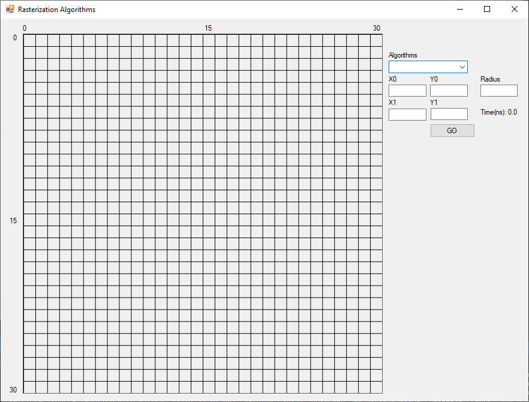
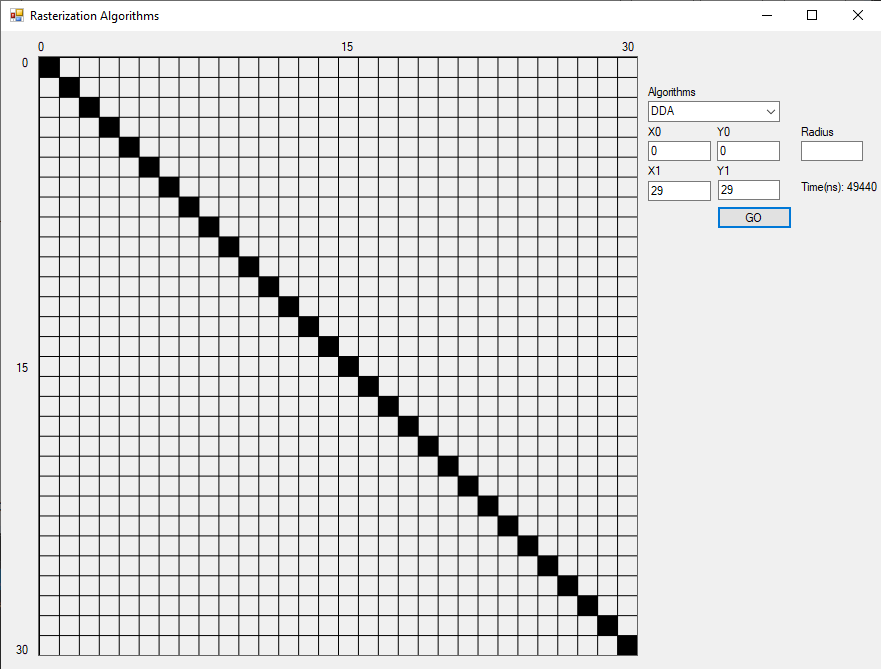
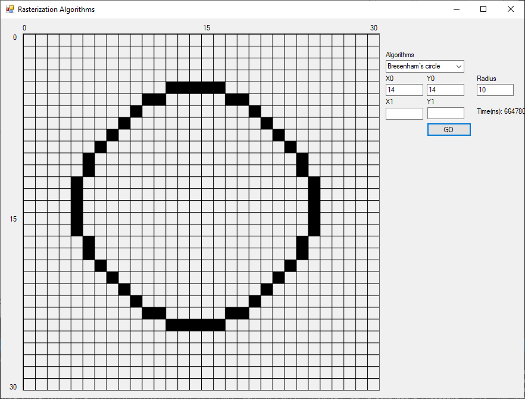

# Лабораторная работа 4

Для реализации был использован язые `C#` с использованием Windows Forms.



## Руководство

Справа пользователю достпуно выпадающие меню, в котором пользователь может выбрать один из следующих алгоритмов:
<li> Step-by-step
<li> DDA
<li> Bresenham`s line
<li> Bresenham`s circle

Пользователь может ввести координаты от 0 до 29 включительно. Ограничений на на радиус окружности нет,
но вводить числа больше 15 нет смысла так как вы не сможете увидеть результат




## Тестирование производительности

Замеры скорости проводились по `1000` раз для каждого алгоритма, после чего вычислялось среднее значение.
<li> Step-by-step - `111.011`
<li> DDA - `109.269`
<li> Bresenham`s line - `101.794`

Исходя из полученных результатов можно сделать вывод, что алгоритм Брезейнхема показывает себя лучше и что, 
если бы линия была бы ещё больше он бы выйграл в скорости значительно сильнее.

## Пример построения линии алгоритмом DDA
Будем рисовать линию от (0, 0) в (4, 5)
``` python
dx = 4
dy = 5

steps = 5 # кол-во шагов

xinc = 0,8 # приращение по x
yinc = 1 # приращение по y

x = 0
y = 0

x += xinc # round(x) = 1
y += yinc # round(y) = 1

x += xinc # round(x) = 2
y += yinc # round(y) = 2

x += xinc # round(x) = 2
y += yinc # round(y) = 3

x += xinc # round(x) = 3
y += yinc # round(y) = 4

x += xinc # round(x) = 4
y += yinc # round(y) = 5
```
