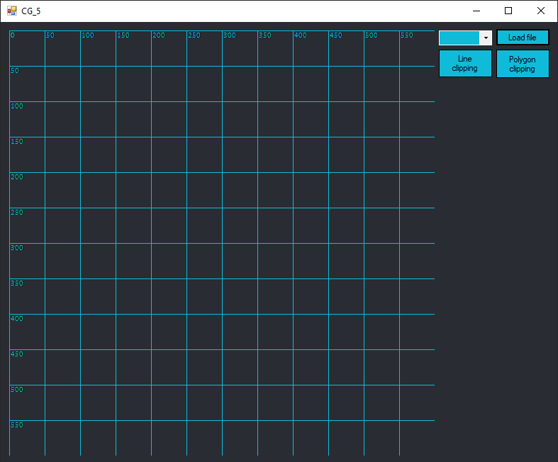
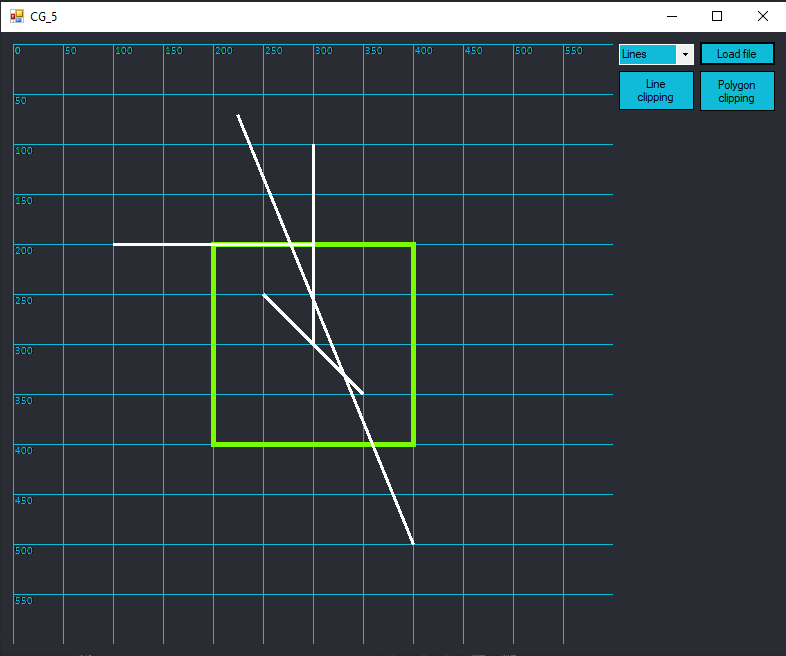
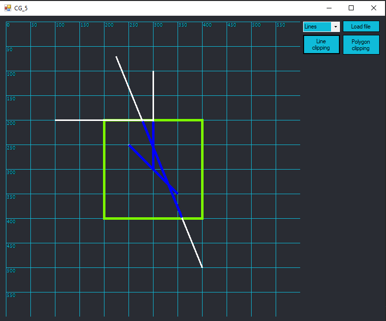
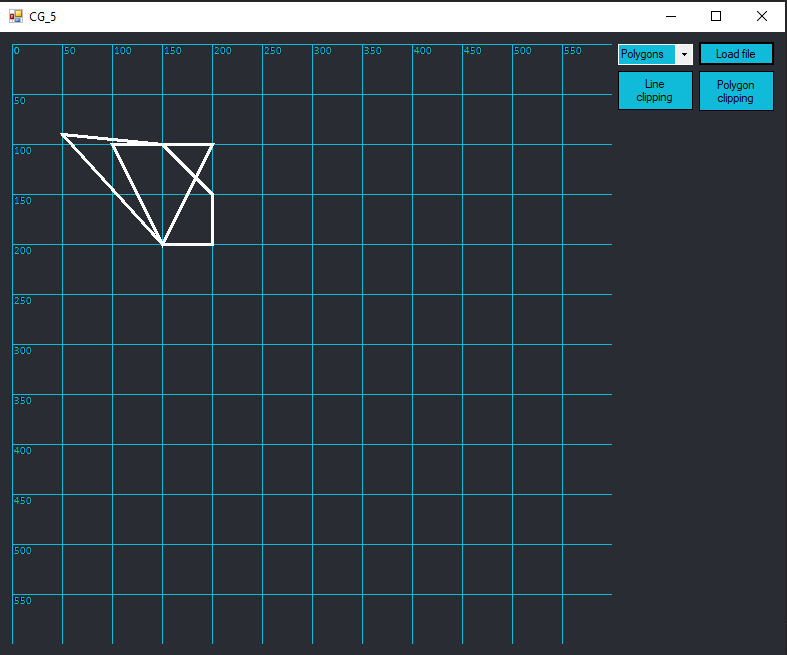
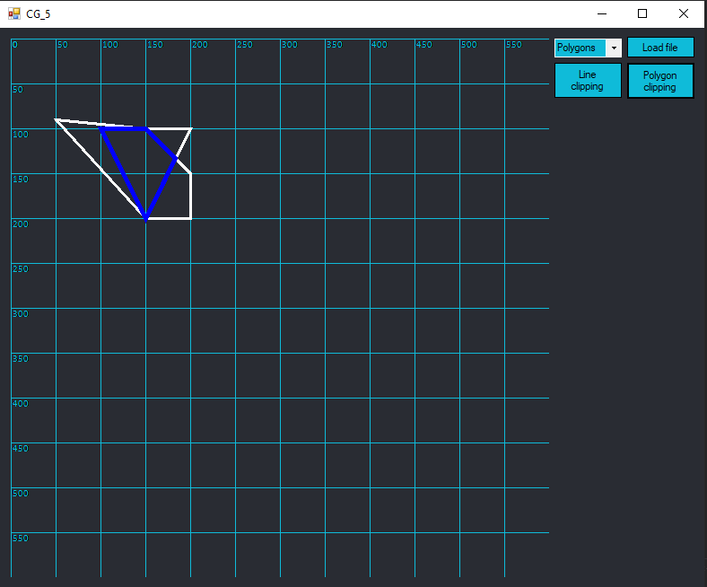

# Лабараторная работа 5

Для реализации был использован язые `C#` с использованием Windows Forms.



## Руководство

В правой части окна доступны 3 кнопка: Load file, Line clipping, Polygon clipping. Нажав на Load, вы можете открыть требуемый вам файл, предворительно выбрав в выпадающем списке какого типа будет файл. 
Нажав на кнопку Line clipping, будут произведено отсчиение прямых.
Нажав на кнопку Polygon clipping, будут произведено отсчиение многоугольника.
Было реализованно несколько алгоритмов:
<li> Middle-point algorithm
<li> Sutherland-Hodgeman algorithm

#### Middle-point algorithm

Каждый отрезок рассматривается отдельно. Если он полностью невидим или имеет длину менее пикселя, мы его отбрасываем. 
Если он полностью виден, мы добавляем его в список сегментов для рисования. В противном случае мы делим его на две части 
и применяем рекурсивно одну и ту же процедуру к обеим половинкам.




#### Sutherland-Hodgeman algorithm

Каждая сторона прямоугольника отсечения рассматривается по очереди. Каждое ребро многоугольника оценивается как принадлежащее одному из следующих классов:
<li> Полностью на видимой стороне. Тогда мы добавляем его начало и конец в список вершин нового обрезанного многоугольника.
<li> Начало края видно, конец невидим. Тогда мы добавляем начало и точку пересечения ребра и стороны.
<li> Начало невидимо, конец виден. Тогда мы добавляем точку пересечения и конец.
<li> Край полностью на невидимой стороне. Тогда мы ничего не делаем.




## Пример использования

Файл для отсечения отрезков:
```
4
224 70 400 500
250 250 350 350
100 200 300 200
300 100 300 300
200 200 200 200
```
Где 4 это кол-во отрезков. Далее идут 4 отрезка, а в конце координаты левой верхей вершины и и ширина с восотой этого прямоугольника.

Файл для отсечения многоульников:
```
3
100 100 
200 100
150 200
5
150 100
200 150
200 200
150 200
50 90
```
Здесь 3 и 5 это кол-во точек полигона. Последний полигон будет идти как отсекающий.

Примеры с файлами можно найти в папке `Data Set`.
