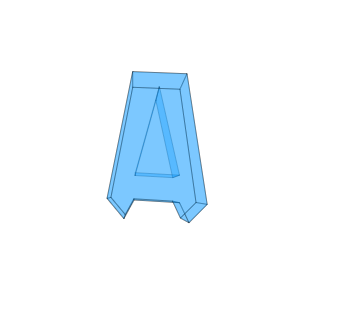

# Лабораторная работа 6

Для реализации был использован язые `JavaScript`.

## Руководство

Для вращения используйте зажатую левую кнопку мышки, а для приближения используйте комбинацию `ctrl+wheel`
